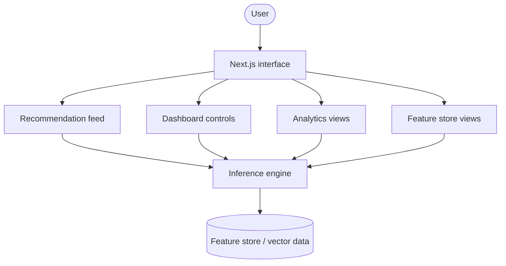

# RecSys-Zero

[](https://nextjs.org/)
[](https://tailwindcss.com/)
[](https://www.typescriptlang.org/)
[](https://react.dev/)

> [!NOTE]
> **RecSys-Zero** is a cinematic recommendation-system dashboard built to feel like an operations console for a live inference stack. It blends high-density metrics, neon glass surfaces, and system-style telemetry to showcase recommendation feeds, model health, analytics, and feature retrieval in one cohesive interface.

## Why It Feels Different

This project is not a generic admin panel. It is designed as a product story for a recommender system: the feed shows personalized ranking surfaces, the dashboard exposes model drift and operational controls, analytics tracks performance over time, and sources documents the feature store behind the scenes.

## What’s Inside

- Live-style recommendation surfaces with cold-start, collaborative filtering, and content-based modes.
- A bento-grid feed with inference cards, model progress, feature importance, and log-style telemetry.
- Operational dashboards for drift detection, stream throughput, cache health, and deployment actions.
- Analytics views for Precision@K, CTR segments, latency, and embedding stability.
- Feature store pages that describe online/offline parity, freshness, and retrieval layers.

## Route Map

- `/` - Main recommendation feed and showcase cards
- `/dashboard` - System status, drift signals, and quick actions
- `/analytics` - Model performance and metric breakdowns
- `/sources` - Unified feature store and retrieval health

## Stack

- Next.js 16 App Router
- React 19
- Tailwind CSS v4
- Motion for interaction polish
- Lucide React and Material Symbols for UI iconography
- TypeScript for type-safe UI structure

## Local Setup

```bash
git clone https://github.com/TheRisingStarr/RecSys-Zero.git
cd RecSys-Zero
npm install
npm run dev
```

Open [http://localhost:3000](http://localhost:3000) to view the app.

## Project Structure

```text
public/                 Static assets
src/app/                App Router pages and layouts
src/app/(dashboard)/    Dashboard group routes
src/app/analytics/      Model performance view
src/app/dashboard/      Operational control view
src/app/sources/        Feature store view
src/components/layout/  Shell components for navigation and chrome
```

## Architecture Sketch



## Environment

- Node.js 18 or newer
- npm, pnpm, yarn, or bun

## Notes

- The interface uses large imagery, glassmorphism, and neon accents to create a high-contrast operational feel.
- If you connect real inference services later, the current page structure already maps cleanly to feed, control, analytics, and source-management surfaces.
