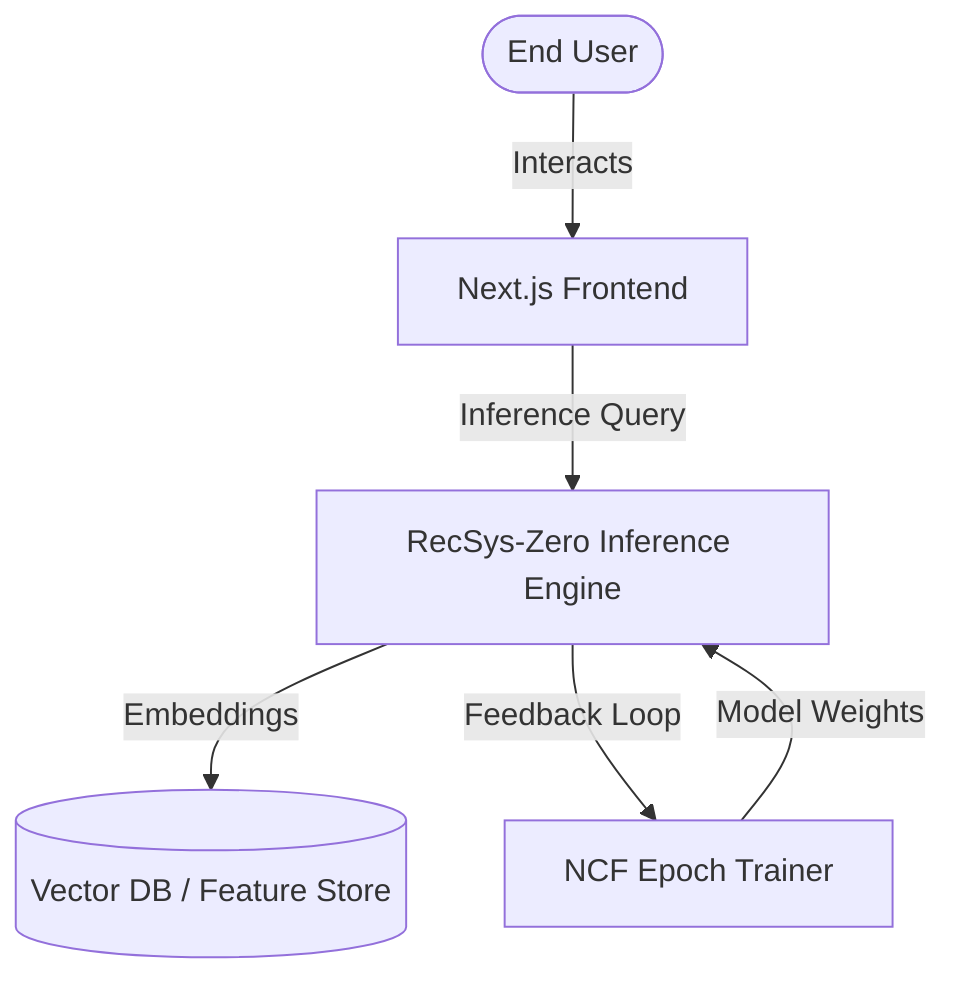

# ⚡ RecSys-Zero (RECO.AI)

[](https://nextjs.org/)
[](https://tailwindcss.com/)
[](https://www.typescriptlang.org/)
[](https://react.dev/)

> [!NOTE]
> **RecSys-Zero** is a next-generation, high-fidelity real-time recommendation system inference dashboard. Engineered using **Next.js 16**, **Tailwind CSS v4**, and **Framer Motion (Motion)**, it delivers a stunning glassmorphic UI representing live collaborative filtering, cold-start exploration, and neural network embedding spaces.

---

## ✨ Key Features

- 🧠 **Real-Time Inference Dash**: Monitor live recommendation generation, latency metrics, and Collaborative Filtering / Content-Based / Cold Start selection.
- 📊 **Bento Grid Analytics**: High-performance visualization dashboard including Feature Importance bar charts and live terminal-like inference streams.
- ⚡ **Tailwind v4 & Motion**: Supercharged animations, hardware-accelerated transitions, neon glows, and custom hover effects (`hover-glow-heavy`).
- 📂 **Flexible Data Flow**: Custom configuration for models, feature stores, analytics, and embedding space settings.
- 🎨 **Material Symbols**: Integrated system icons for an intuitive, premium, dark-mode-first developer experience.

---

## 📊 Obsidian Charts Integration

For developers tracking metrics inside **Obsidian** via the **Obsidian Charts** plugin, copy the block below directly into your workspace notes:

```chart
type: bar
labels: [Neural NCF, Matrix Factorization, Content-Based, Cold Start]
series:
  - title: Accuracy Rate (%)
    data: [92.4, 81.2, 76.5, 61.0]
  - title: Expected CTR Lift (%)
    data: [14.2, 9.8, 7.1, 4.5]
```

---

## 🛠️ Architecture Overview



---

## 🚀 Getting Started

### 📋 Prerequisites

- **Node.js** >= 18.x
- **npm** or **yarn** / **pnpm** / **bun**

### 📦 Installation

Clone the repository and install dependencies:

```bash
# Clone the repository
git clone https://github.com/DEVANSHKANODIA/RecommendationSystem.git
cd RecommendationSystem

# Install packages
npm install
```

### 💻 Running Locally

Launch the Next.js development server:

```bash
npm run dev
```

Open [http://localhost:3000](http://localhost:3000) to view the live dashboard.

---

## 📂 Project Structure

```
├── public/                 # Static assets and icons
├── src/
│   ├── app/                # Next.js App Router pages
│   │   ├── (dashboard)/    # Dashboard layout groups
│   │   ├── analytics/      # Live system diagnostics
│   │   ├── dashboard/      # Configuration & controls
│   │   ├── sources/        # Feature store connections
│   │   ├── globals.css     # Design tokens & neon utilities
│   │   └── page.tsx        # Main Feed & Bento overview
│   └── components/
│       └── layout/         # Navigation & header shells
```

---

## 🌟 Tech Stack

| Technology | Purpose | Key Benefit |
| :--- | :--- | :--- |
| **Next.js 16** | Application Framework | App Router, Server Components & SEO optimization |
| **React 19** | UI Library | Concurrent rendering and state management |
| **Tailwind CSS v4** | CSS Utility Engine | Ultra-fast build times, custom color channels |
| **Motion** | Fluid Animations | Physics-based spring micro-interactions |
| **Lucide Icons** | Iconography | Clean, modern, scalable vector symbols |
| **Google GenAI** | Smart Recommendations | Powered by Gemini models for embedding mapping |

---

> [!TIP]
> To configure custom Gemini embedding generation, set your API key environment variable:
> `export GEMINI_API_KEY="your-api-key"`
